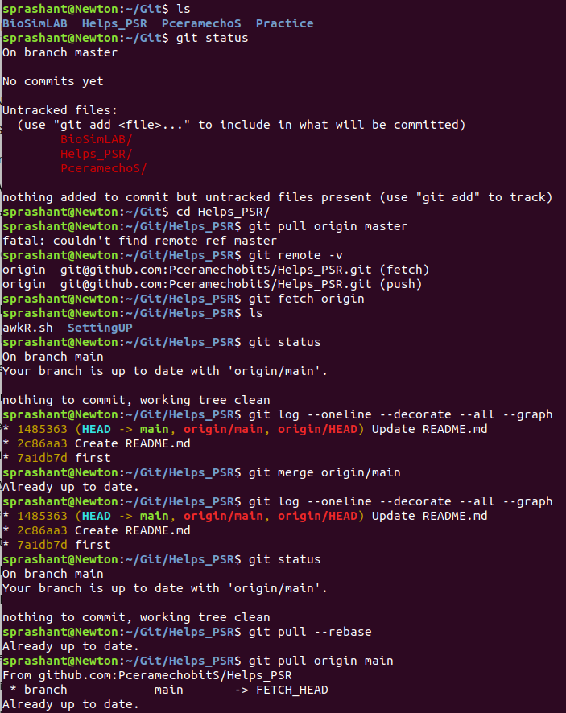

# 📦 GitHub Setup Guide  

This README explains how to **set up Git and GitHub**, connect a **local machine to a GitHub repository**, and **push (upload) and fetch/pull (download) data** between them.
It is intended for **students, researchers, and beginners**.

---

## 🔹 Prerequisites

- A **GitHub account** → [https://github.com](https://github.com "Visit GitHub") 
- **Git installed** on your local machine. Check Git installation: `git --version`

## 🔹  Quick setup
Get started by working directly in the
[Project Repository](https://github.com/PceramechobitS/PceramechoS.git "https://github.com/PceramechobitS/PceramechoS").
You can create new files or upload existing ones either at the repository root,
inside the [scripts folder](scripts/), or by editing specific files such as the
[README](README.md).

### 🔹 Repository layout

For a clean and well-maintained project, we recommend that every repository
include the following:
- `README.md` — project description and usage instructions
- `LICENSE` — licensing information
- `.gitignore` — files and directories to exclude from version control
- `scripts/` — analysis and simulation scripts  
- `docs/` — documentation and notes  
- `data/` — input files  
- `results/` — generated output (gitignored)

```
~/Git/
├── BioSimLAB
├── Helps_PSR
├── PceramechoS   ← your current project repo
│   ├── README.md
│   ├── scripts/
│   │   └── run.sh
│   ├── docs/
│   │...└── setup.md
│   
├── Practice
│...
```
## 🧠  Push & Fetch Data Between Local Machine and Repository
GitHub does not accept passwords — use SSH or a Personal Access Token.
### 🔐 SSH (Recommended – one-time setup)

1️⃣ Check for existing SSH key: `ls ~/.ssh`

2️⃣ Generate SSH key (if not present): `ssh-keygen -t ed25519 -C "your_email@example.com"`

3️⃣ Copy public key. Copy the entire line from terminal: `cat ~/.ssh/id_ed25519.pub`

4️⃣ Add the key to GitHub:
- GitHub → Settings
- SSH and GPG keys
- New SSH key
- Paste → Save

5️⃣ Change repo remote to SSH: `git remote add origin git@github.com:PceramechobitS/PceramechoS.git` or `git remote set-url origin git@github.com:PceramechobitS/PceramechoS.git`
- Verify: `git remote -v`
- You should see: `git@github.com:PceramechobitS/PceramechoS.git`
- Test connection: `ssh -T git@github.com`
- Expected Outcome: `Hi PceramechobitS! You've successfully authenticated...`

### 🚀 Push `PceramechoS` to GitHub
Suppose You’re at your Git workspace root, and everything looks perfectly normal.

1️⃣ Move into the repository to be pushed: `cd PceramechoS`

2️⃣ Confirm it’s a Git repo: `git status`

2️⃣ Stage everything at once; `git add .`

3️⃣ Commit the changes: `git commit -m "Add initial project structure, scripts, docs, and data"`

4️⃣ Push to GitHub: `git push origin main` Replace `main` if your branch name is different (`master`).


🧠 For Pushing only specific folders/files, use: `git add scripts docs README.md`

🧠 If `results/` should NOT be pushed. Add it to .gitignore before `git add .`

#### 🎯 You’re done
Your directory: `data/  docs/  scripts/  results/  README.md  LICENSE` will now be pushed all at once.


### 🚀 Fetch `Helps_PSR` from GitHub

#### 🔹 Case 1: First time — get the repo locally (clone)
If you don’t have the repository yet: `git clone git@github.com:PceramechobitS/PceramechoS.git`

#### 🔹 Case 2: Fetch + update in one step (pull)
`git pull origin main`  fetches + merges immediately.

#### 🔹 Case 3: Fetch updates for an existing local repo
1️⃣ Go into the repository: `cd ~/Git/PceramechoS`

2️⃣ Fetch from remote: `git fetch origin` Downloads new commits, branches, tags.

3️⃣ See what changed: `git status` or `git log --oneline --decorate --all --graph`

4️⃣ If you want the updates: `git pull --rebase` or `git merge origin/main` 

🧠 Fetch a specific branch: `git fetch origin dev`

🧠 Fetch all remotes & branches: `git fetch --all`

---

## 🔑 Takeaways
> ❌ Do NOT run `git add .` from `~/Git/`
 
> ✅ Always `cd` into the repository directory before using Git commands.

> ✅ `git add .` → `git commit` → `git push` pushes everything at once.

> ✅ `git fetch` is safe — it never changes your local work.

> ✅ Store images inside the repo and link using relative paths.

> ✅ **Relative paths work only *inside* a repository, not to the repository itself.**

| Want to link to | Use |Example
|----|----|----|
| File/folder inside repo | Relative path | [scripts/](scripts/ "script folder")|
| Another repo | Absolute URL | https://github.com/PceramechobitS/BioSimLAB.git.
| Same file section | `#heading-name` | |
| Repo itself | Absolute GitHub URL |https://github.com/PceramechobitS/PceramechoS.git|

<p align="center">
  
</p>
